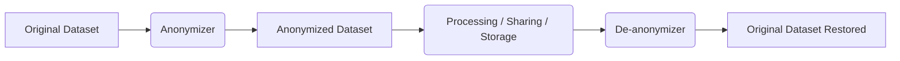

# Camouflage 🛡️


> **Anonymize. Protect. Restore.**  
> Flexible and reversible anonymization for modern Python workflows.

---

# ✨ What is Camouflage?

Camouflage lets you easily **anonymize** sensitive data, **store** reversible mappings, and **restore** the original dataset when needed — all while being
fast, lightweight, and fully customizable.

- 🔥 Anonymize large datasets quickly.
- 🛠️ Add your **own plugins** easily (your data, your rules).
- 🔄 Reversible by design — restore original values without headaches.
- 🧪 **100% test coverage** for maximum trust.
- 🏎️ Tested on datasets with over **100,000 rows** across **6 columns** — handles big data smoothly.

---

# 📈 How it Works



Camouflage guarantees that every anonymized value is **unique**, **consistent**, and **traceable back** — only when you need it.

---

# 🚀 Quick Start

## 1️⃣ One-Time Anonymization

```python
from camouflage import anonymize

original_value = "192.168.1.1"

anonymized_value = anonymize("ipv4", original_value)
```

## 2️⃣ Reversible Anonymization

```python
from camouflage import anonymize, deanonymize, Transform

original_value = "192.168.1.1"

transform = Transform()

# Anonymize
anonymized_value = anonymize("ipv4", original_value, transform)

# Do something with the anonymized value
# ...

# De-anonymize
deanonymized_value = deanonymize("ipv4", anonymized_value, transform)
```

## 3️⃣ Anonymizing a Pandas DataFrame

```python
import pandas as pd
from camouflage import PandasAdapter

df = pd.DataFrame({
    "ip": ["192.168.1.1", "10.0.0.1"],
    "joined_at": [pd.Timestamp("2023-01-01"), pd.Timestamp("2023-02-01")],
    "revenue": [1234.56, 7890.12],
})
# | ip          | joined_at           |   revenue |
# |:------------|:--------------------|----------:|
# | 192.168.1.1 | 2023-01-01 00:00:00 |   1234.56 |
# | 10.0.0.1    | 2023-02-01 00:00:00 |   7890.12 |

mapper = {
    "ip": "ipv4",
    "joined_at": "datetime",
    "revenue": "amount",
}

pd_adapter = PandasAdapter(mapper)

df_safe = pd_adapter.anonymize(df)
# | ip             | joined_at           |   revenue |
# |:---------------|:--------------------|----------:|
# | 137.224.91.30  | 2024-12-05 00:00:00 |   1279.97 |
# | 213.209.12.210 | 2023-06-27 00:00:00 |   5506.58 |

# Do something with the anonymized DataFrame
# ...

# When you want to restore:
original_df = pd_adapter.deanonymize(df_safe)
# | ip          | joined_at           |   revenue |
# |:------------|:--------------------|----------:|
# | 192.168.1.1 | 2023-01-01 00:00:00 |   1234.56 |
# | 10.0.0.1    | 2023-02-01 00:00:00 |   7890.12 |
```

---

# 🧩 Extending with Custom Anonymizers

Want to anonymize new types of data? Super easy:

## 1️⃣ Create your Custom Anonymizers

```python
import random


def anonymize_color(_):  # It is crucial for the anonymizer to accept a single argument.
    return random.choice(['red', 'green', 'blue'])


def anonymize_red_channel(original_hex):
    hex_color = original_hex.lstrip('#')
    
    green = hex_color[2:4]
    blue = hex_color[4:6]
    
    random_red = random.randint(0, 255)
    
    return "#{:02X}{}{}".format(random_red, green, blue)
```

## 2️⃣ Register the Anonymizers

```python
from camouflage import register_anonymizer

register_anonymizer('color', anonymize_color)
register_anonymizer('red_channel', anonymize_red_channel)
```

## 3️⃣ Use the Custom Anonymizers

```python
from camouflage import anonymize

original_value = "cyan"
anonymized_value = anonymize("color", original_value)

original_hex = "#00FF00"
anonymized_hex = anonymize("red_channel", original_hex)
```

## 4️⃣ Or Use the Custom Anonymizers for Pandas

```python
import pandas as pd
from camouflage import PandasAdapter

df = pd.DataFrame({
    "color": ["cyan", "magenta", "yellow"],
    "hex": ["#FF0000", "#00FF00", "#0000FF"],
})
# | color   | hex     |
# |:--------|:--------|
# | cyan    | #FF0000 |
# | magenta | #00FF00 |
# | yellow  | #0000FF |

mapper = {
    "color": "color",
    "hex": "red_channel",
}

pd_adapter = PandasAdapter(mapper)
df_safe = pd_adapter.anonymize(df)
# | color   | hex     |
# |:--------|:--------|
# | green   | #B90000 |
# | blue    | #96FF00 |
# | red     | #FD00FF |
```

✅ That's it — now you can anonymize columns as `"color"` or `"red_channel"` either one-time or in adapters!

---

# ✅ Quality You Can Trust

- ✅ **100% code coverage** (Pytest + Coverage)
- ✅ **PEP8 compliant**, linted
- ✅ **Fast anonymization** for datasets of **100,000+ rows**
- ✅ **Extensible plugin system**
- ✅ **Tested** and **battle-ready**

---

# 📜 License

MIT License — do whatever you want, but be cool. ✌️

---

# 👨‍💻 Made with ❤️ by Developers, for Developers.

Camouflage is built to **empower** privacy-first applications without slowing you down.

---

# ✨ Ready to get started?

```bash
pip install camouflage
```

---

# 🔗 Links

Source Code: https://github.com/NazarNintendo/camouflage